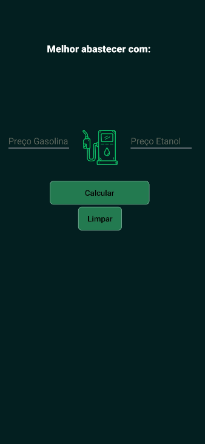

# ⛽ Calculadora Etanol ou Gasolina

Um aplicativo Android nativo e leve para ajudar motoristas a economizarem na hora de abastecer, calculando a relação de custo-benefício entre o Etanol e a Gasolina com base na regra clássica dos **70%**.

---

## 🚀 Funcionalidades

* **Cálculo Inteligente:** Descubra instantaneamente qual combustível vale mais a pena baseado nos preços por litro.
* **Escudo Anti-Crash (Tratamento de Erros):** O aplicativo valida os campos de entrada, exibindo alertas visuais em vermelho (`.setError`) se o usuário digitar letras ou deixar campos em branco, impedindo o app de quebrar.
* **Proteção Matemática:** Bloqueio contra divisão por zero se o preço da gasolina for inserido como `0`.
* **Feedback Visual:** Alerta em balão (`Toast`) com emoji de confirmação (`✅`) ao limpar os dados da tela.
* **Interface Otimizada:** Teclado configurado para abrir diretamente no modo numérico decimal, facilitando a digitação rápida no posto de combustível.

---

## 🛠️ Tecnologias e Recursos Utilizados

* **Linguagem:** Java
* **IDE:** Android Studio
* **Layout:** `ConstraintLayout` (Interface responsiva)
* **Componentes de UI:** `EditText` (com `numberDecimal`), `TextView`, `Button`, `ImageView`
* **Gerenciamento de Erros:** Blocos `try-catch` capturando `NumberFormatException`

---

## 📸 Interface do Aplicativo

  

---

## 🧬 Como o cálculo é feito?

O aplicativo faz a divisão matemática do preço do Etanol pelo preço da Gasolina:

Onde o cálculo é feito dividindo o valor do Etanol pelo da Gasolina. Se o resultado for menor que 0.70, o **Etanol** é mais vantajoso. Se for igual ou maior, a **Gasolina** vence.

---

## ⚙️ Como rodar o projeto

1. Faça o clone deste repositório ou baixe os arquivos de código.
2. Abra o **Android Studio**.
3. Vá em `File > Open` e selecione a pasta do projeto.
4. Conecte seu celular via Depuração USB ou abra um Emulador.
5. Clique no botão **Run (Play verde)** `▶️`.
